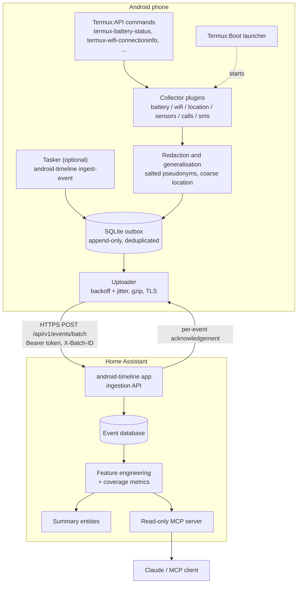

# android-timeline-termux

[](https://github.com/resace3/android-timeline-termux/actions/workflows/ci.yml)
[](https://github.com/resace3/android-timeline-termux/actions/workflows/security.yml)
[](https://github.com/resace3/android-timeline-termux/actions/workflows/termux-container.yml)
[](https://github.com/resace3/android-timeline-termux/actions/workflows/android-emulator.yml)
[](LICENSE)

> **Status: experimental.** This software has **never been run on a physical
> Android phone.** Everything below is validated in CI only. See
> [Testing status](#testing-status) for exactly what that means, and
> [docs/testing-limitations.md](docs/testing-limitations.md) for the detail.

An offline-first event collector that runs inside [Termux](https://termux.dev)
on Android, stores raw timestamped observations in an append-only SQLite
outbox, and uploads them in authenticated, idempotent batches to a
[Home Assistant app](https://github.com/resace3/android-timeline-home-assistant).

The phone is always the client. It never listens on a socket, never accepts
a remote command, and never exposes a shell.

## What it does

- Polls a small set of Termux:API sources (battery, Wi-Fi, location,
  sensors, and -- opt-in only -- call and SMS **metadata**).
- Writes every observation once into a local SQLite queue that survives
  reboots, crashes and long offline periods.
- Uploads batches over HTTPS with a device-specific bearer token, retrying
  with exponential backoff and jitter.
- Emits heartbeats so the server can tell "nothing happened" apart from
  "the collector was dead" -- the difference that makes the data usable.
- Never deletes a raw event unless you explicitly enable retention.

## Architecture



The acknowledgement arrow is the important one: an event is marked uploaded
**only** when the server names its `event_id`. Anything else stays queued.

## Testing status

This is the part most likely to be misread, so it is stated plainly.

| Layer | Environment | Status | What it proves |
| --- | --- | --- | --- |
| 1 | Ubuntu, Python 3.11-3.13 | **Required, passing** | Event model, SQLite outbox, deduplication, batching, retry and backoff, config validation, redaction, schema conformance, CLI, and a full upload round trip against a real local HTTP server. |
| 2 | Official `termux/termux-docker` | **Informational, non-blocking** | The genuine Termux filesystem layout, `PREFIX`/`HOME`, the unprivileged uid 1000, and that our installer accepts real Termux while refusing an ordinary Linux image. Package installation usually fails on GitHub runners -- see below. |
| 3 | Android emulator (API 34, x86_64) | **Non-blocking** | Boot, pushing the payload to a real Android filesystem, the outbox schema under the device's own SQLite, and an authenticated batch upload over the emulator host bridge. |
| 4 | Physical Android device | **NOT DONE** | Nothing. No physical device has ever run this. |

### Layer 2 in detail

The official Termux Docker image is used, not a substitute. Two upstream
realities are handled honestly rather than worked around:

- GitHub Actions replaces a job container's entrypoint with `tail -f
  /dev/null`, bypassing `termux-docker`'s `/entrypoint.sh`. The workflow
  therefore drives `docker run` directly.
- `pkg install` inside the image typically fails on GitHub runners with
  *"None of the mirrors are accessible"*, a container DNS problem that
  upstream closed as wontfix
  ([termux/termux-docker#51](https://github.com/termux/termux-docker/issues/51)).
  The workflow attempts it, records the exact failure in the job summary,
  and continues with the checks that do not need the network.

**A Linux container running the Termux rootfs is not Android.** There is no
Android framework, no Termux:API, no Binder, no battery and no sensors in
that container, and this repository never claims otherwise.

### What no CI layer can prove

Real GPS quality, accelerometer behaviour, Health Connect completeness,
notification listener access, manufacturer battery-killing, cellular modem
data, real SMS or call logs, physical Bluetooth devices, Termux:Boot after a
genuine reboot, and multi-day background reliability. These are tracked in
the [Real Android device acceptance testing](https://github.com/resace3/android-timeline-termux/issues)
issue and must not be marked done without evidence from a real phone.

## Security model

Deny by default. The full model is in [docs/security.md](docs/security.md);
the short version:

- **No inbound anything.** No server, no listener, no remote shell.
- **No plaintext transport in production.** Enabling an insecure endpoint
  requires *three* independent locks: a config flag, an environment variable
  set to an exact phrase, and a loopback/emulator hostname. Any one missing
  and the collector refuses to start.
- **Secrets are never in config.** The bearer token and the pseudonymisation
  salt live in separate `0600` files. No command prints either; `doctor`
  shows only a length and a digest prefix.
- **Sensitive sources are off by default.** Call and SMS collection are
  disabled; message bodies and contact names are never stored unless
  explicitly enabled; phone numbers become salted HMAC pseudonyms.
- **Raw coordinates are off by default.** `location_mode` defaults to
  `disabled`; `coarse` and `geohash` never emit full precision.
- **The runtime has zero third-party dependencies**, enforced by CI. Nothing
  to audit beyond the Python standard library, and no compiler needed on the
  phone.

## Installation

Full instructions, including which app store to install Termux from and why
mixing sources breaks: [docs/installation.md](docs/installation.md).

```bash
# In Termux:
pkg install python git
git clone https://github.com/resace3/android-timeline-termux
cd android-timeline-termux
./scripts/install-termux.sh
```

Then edit `~/.config/android-timeline/config.toml`, paste your enrollment
token into `~/.config/android-timeline/token`, and run:

```bash
android-timeline doctor --check-server
```

> Termux, Termux:API and Termux:Boot must all come from the **same**
> distribution source (all F-Droid, or all GitHub releases). Android refuses
> to let differently-signed apps talk to each other, and the failure looks
> like "the commands just hang". See
> [docs/installation.md](docs/installation.md).

## Configuration

`config.example.toml` is the annotated reference and is generated from the
CLI template, so it can never drift (CI checks this). Highlights:

| Setting | Default | Notes |
| --- | --- | --- |
| `privacy.location_mode` | `disabled` | `coarse`, `geohash`, `precise`, `raw` |
| `privacy.store_message_bodies` | `false` | opt-in only |
| `privacy.store_contact_names` | `false` | opt-in only |
| `collectors.calls.enabled` | `false` | metadata only when enabled |
| `collectors.sms.enabled` | `false` | metadata only when enabled |
| `retention.enabled` | `false` | acknowledged raw events are kept forever |
| `server.verify_tls` | `true` | cannot be disabled outside test mode |

## Commands

```
android-timeline init           create a configuration file
android-timeline collect-once   run every enabled collector once
android-timeline run            the collection loop (what Termux:Boot starts)
android-timeline upload         drain the queue now
android-timeline status         queue depth and collector state
android-timeline doctor         diagnose the installation
android-timeline export         export raw events as JSON
android-timeline ingest-event   record an external event (e.g. from Tasker)
```

`doctor` reports Termux detection, Termux:API command availability, config
validity, database writability, queue status, server reachability, the last
successful upload, enabled collectors and missing permissions. It never
prints a token.

## Development

```bash
python -m pip install -e ".[dev]"
ruff format . && ruff check . && mypy
pytest
```

Collectors are exercised through a mockable command adapter, so the whole
collection layer runs on an ordinary Linux machine:

```bash
export ANDROID_TIMELINE_TERMUX_MOCK_DIR=tests/fixtures/termux
android-timeline --json collect-once
```

## Relationship to the other repository

| | |
| --- | --- |
| **This repository** | runs on the phone, produces raw events, owns the outbox and the upload client |
| [`android-timeline-home-assistant`](https://github.com/resace3/android-timeline-home-assistant) | runs in Home Assistant, owns ingestion, storage, feature engineering and the read-only MCP server |

The Home Assistant repository is the **source of truth** for the protocol
schemas in `schemas/`. This repository vendors a byte-identical copy, guarded
by `schemas/PROTOCOL_SHA256SUMS`; the cross-repository end-to-end workflow
compares the two directly. Both currently speak `protocol_version` 1.
Backward-compatibility policy: [docs/architecture.md](docs/architecture.md).

## Privacy considerations

This software is designed to collect data about *you*, on *your* device, and
send it to *your* server. Even so:

- Everything sensitive is off by default and must be turned on deliberately.
- Pseudonymisation is per-device and salt-based: the same phone number
  produces different pseudonyms on different devices, so exports cannot be
  joined without the salt.
- Nothing is sent anywhere except the server URL you configure.
- No fixture, test or CI artifact in this repository contains real personal
  data, and CI actively fails if a credential-shaped string appears.

If other people appear in your data (they will -- calls and messages have
two ends), consider whether you have a basis for recording it. Metadata-only
defaults exist for that reason.

## Roadmap

- [ ] Physical-device acceptance testing (blocking for a 1.0)
- [ ] Termux:Boot verification after a real reboot
- [ ] Optional helper APK for sources Termux cannot observe well
- [ ] QR-code device enrollment
- [ ] Richer Tasker recipes
- [ ] Battery-impact measurement on a real phone

## License

[MIT](LICENSE)
